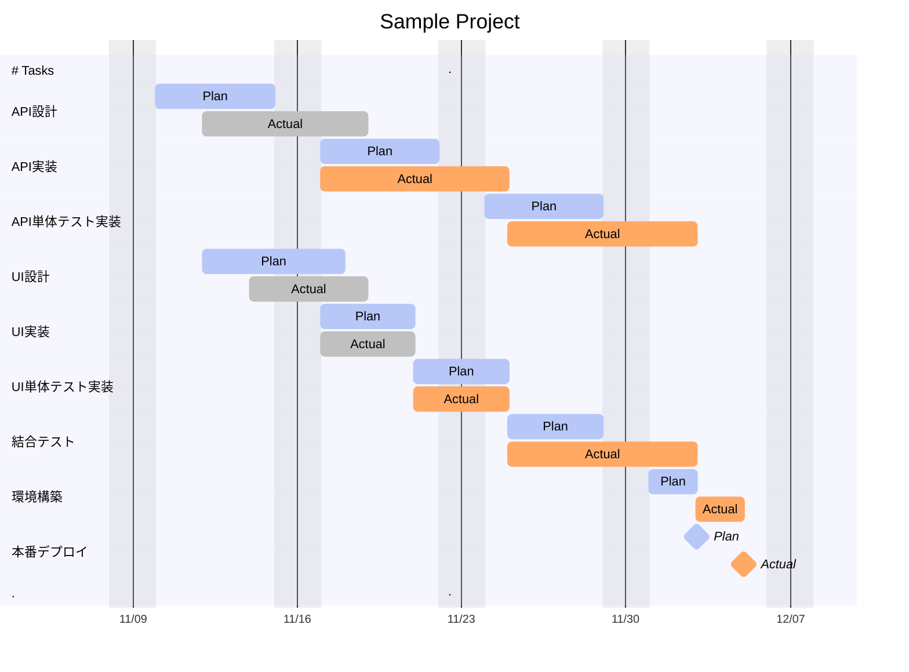

# Gantt Chart

```mermaid
%%{
    init: {
        'theme': 'default',
        'themeVariables': {
            'sectionBkgColor': '#d1d1ff',
            'altSectionBkgColor': '#d1d1ff',
            'sectionBkgColor2': '#d1d1ff',

            'textColor': '#000000',
            'taskTextLightColor': '#000000',
            'taskTextDarkColor': '#000000',

            'taskBkgColor': 'transparent',
            'taskBorderColor': 'transparent',

            'taskTextColor': '#000000',
            'taskTextOutsideColor': '#000000',
            'critBkgColor': '#b7c7f8',
            'critBorderColor': '#b7c7f8',

            'activeTaskBkgColor': '#ffa965',
            'activeTaskBorderColor': '#ffa965',

            'doneTaskBkgColor': '#c0c0c0',
            'doneTaskBorderColor': '#c0c0c0'
        }
    }
}%%

gantt
    title  Sample Project
    dateFormat  YYYY-MM-DD
    axisFormat  %m/%d
    tickInterval 1week
    excludes  weekends

    %% プロジェクト全体の期間を共通で設定するためのダミーセクション
    section # Tasks
        . :, 2025-11-07, 2025-12-08

    section API設計
        Plan    :crit, 2025-11-10, 5d
        Actual  :done, 2025-11-12, 5d

    section API実装
        Plan    :crit, 2025-11-17, 5d
        Actual  :active, 2025-11-17, 6d

    section API単体テスト実装
        Plan    :crit, 2025-11-24, 5d
        Actual  :active, 2025-11-25, 6d

    section UI設計
        Plan    :crit, 2025-11-12, 4d
        Actual  :done, 2025-11-14, 3d

    section UI実装
        Plan    :crit, 2025-11-17, 4d
        Actual  :done, 2025-11-17, 4d

    section UI単体テスト実装
        Plan    :crit, 2025-11-21, 2d
        Actual  :active, 2025-11-21, 2d

    section 結合テスト
        Plan    :crit, 2025-11-25, 4d
        Actual  :active, 2025-11-25, 6d

    section 環境構築
        Plan    :crit, 2025-12-01, 2d
        Actual  :active, 2025-12-03, 2d

    section 本番デプロイ
        Plan    :milestone,crit, 2025-12-03, 0d
        Actual  :milestone,active, 2025-12-05, 0d

    %% 上下のマージンを調整するためのダミーセクション
    section .
        . :, 2025-11-07, 2025-12-08
```
