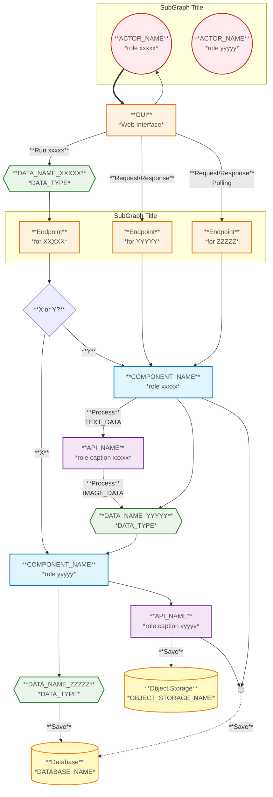

# System Architecture Diagram

- **実線矢印 (→)**: データフローまたは処理の流れ
- **点線矢印 (⇢)**: データの保存・永続化

```mermaid
graph TB

    %%%%%%%%%%%%%%%%%%%%%%%%%%%%%%%%%%%%%%%
    %%%%%%%%%%% Node Definition %%%%%%%%%%%
    %%%%%%%%%%%%%%%%%%%%%%%%%%%%%%%%%%%%%%%

    %% アクター定義
    AC_user((**ACTOR_NAME**<br/>*role xxxxx*))
    AC_admin((**ACTOR_NAME**<br/>*role yyyyy*))

    %% ノード定義(インターフェイス)
    IF_gui[**GUI**<br/>*Web Interface*]
    EP_xxxxx[**Endpoint**<br/>*for XXXXX*]
    EP_yyyyy[**Endpoint**<br/>*for YYYYY*]
    EP_zzzzz[**Endpoint**<br/>*for ZZZZZ*]

    %% ノード定義(コンポーネント)
    CP_xxxxx[**COMPONENT_NAME**<br/>*role xxxxx*]
    CP_yyyyy[**COMPONENT_NAME**<br/>*role yyyyy*]

    %% ノード定義(外部サービス)
    ES_xxxxx[**API_NAME**<br/>*role caption xxxxx*]
    ES_yyyyy[**API_NAME**<br/>*role caption yyyyy*]

    %% ノード定義(データ)
    DT_xxxxx{{**DATA_NAME_XXXXX**<br/>*DATA_TYPE*}}
    DT_yyyyy{{**DATA_NAME_YYYYY**<br/>*DATA_TYPE*}}
    DT_zzzzz{{**DATA_NAME_ZZZZZ**<br/>*DATA_TYPE*}}

    %% ノード定義(ストレージ)
    ST_database[(**Database**<br/>*DATABASE_NAME*)]
    ST_objectstorage[(**Object Storage**<br/>*OBJECT_STORAGE_NAME*)]

    %% ノード定義(分岐)
    BR_xxxxx{**X or Y?**}

    %% ノード定義(マージポイント)
    MG_xxxxx(( ))

    %% サブグラフ定義
    subgraph "SG_user" ["SubGraph Title"]
        AC_user
        AC_admin
    end

    subgraph "SG_xxxxx" ["SubGraph Title"]
        EP_xxxxx
        EP_yyyyy
        EP_zzzzz
    end

    %%%%%%%%%%%%%%%%%%%%%%%%%%%%%%%%%%%%%%%
    %%%%%%%%%%% Flow Definition %%%%%%%%%%%
    %%%%%%%%%%%%%%%%%%%%%%%%%%%%%%%%%%%%%%%

    %% ユーザーとGUIの関係
    AC_user ==> IF_gui
    IF_gui --> AC_user

    %% GUIとエンドポイントの関係
    IF_gui -->|**Run xxxxx**| DT_xxxxx
    DT_xxxxx --> EP_xxxxx
    IF_gui -->|**Request/Response**| EP_yyyyy
    IF_gui -->|**Request/Response**<br/>Polling| EP_zzzzz

    %% エンドポイントとコンポーネントの関係
    EP_xxxxx --> BR_xxxxx
    BR_xxxxx -->|**Y**| CP_xxxxx
    BR_xxxxx -->|**X**| CP_yyyyy
    EP_yyyyy --> CP_xxxxx
    EP_zzzzz --> CP_xxxxx

    %% コンポーネントと外部サービスの関係
    CP_xxxxx -->|**Process**<br/>TEXT_DATA| ES_xxxxx
    CP_yyyyy --> ES_yyyyy

    %% データの流れ
    DT_zzzzz -.->|**Save**| ST_database

    %% 外部サービスとデータの関係
    ES_xxxxx -->|**Process**<br/>IMAGE_DATA| DT_yyyyy
    ES_yyyyy --> MG_xxxxx
    MG_xxxxx -.->|**Save**| ST_database

    %% コンポーネントとマージポイントの関係
    CP_xxxxx --> MG_xxxxx

    %% コンポーネントとデータの関係
    CP_xxxxx --> DT_yyyyy
    DT_yyyyy --> CP_yyyyy
    CP_yyyyy --> DT_zzzzz

    %% データとストレージの関係
    ES_yyyyy -.->|**Save**| ST_objectstorage

    %%%%%%%%%%%%%%%%%%%%%%%%%%%%%%%%%%%%%%%
    %%%%%%%%%%% Style Definition %%%%%%%%%%
    %%%%%%%%%%%%%%%%%%%%%%%%%%%%%%%%%%%%%%%

    %% 登場人物
    class AC_user,AC_admin actor
    classDef actor fill:#ffebee,stroke:#c62828,stroke-width:2px,color:#555

    %% インターフェース
    class IF_gui,EP_xxxxx,EP_yyyyy,EP_zzzzz interface
    classDef interface fill:#fff3e0,stroke:#ef6c00,stroke-width:2px,color:#555

    %% コンポーネント
    class CP_xxxxx,CP_yyyyy component
    classDef component fill:#e1f5fe,stroke:#0277bd,stroke-width:2px,color:#555

    %% 外部サービス
    class ES_xxxxx,ES_yyyyy,ES_zzzzz external
    classDef external fill:#f3e5f5,stroke:#6a1b9a,stroke-width:2px,color:#555

    %% データ
    class DT_xxxxx,DT_yyyyy,DT_zzzzz data
    classDef data fill:#e8f5e8,stroke:#2e7d32,stroke-width:2px,color:#555

    %% マージポイント
    class MG_xxxxx,MG_yyyyy merge
    classDef merge fill:#e0e0e0,stroke:#757575,stroke-width:1px,color:#555

    %% ストレージ
    class ST_database,ST_objectstorage storage
    classDef storage fill:#fff9c4,stroke:#f57f17,stroke-width:2px,color:#555
```
